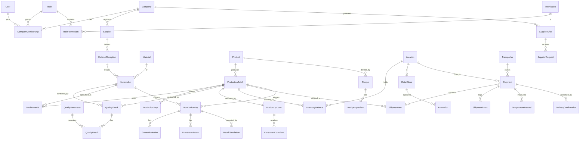

# Diagramme entité-relation (entités principales)
Le fichier `server/prisma/schema.prisma` (61 modèles) fait foi ; il est régénérable via `python scripts/gen-schema.py`.

```mermaid
erDiagram
  Company ||--o{ CompanyMembership : has
  User ||--o{ CompanyMembership : joins
  Role ||--o{ CompanyMembership : grants
  Role ||--o{ RolePermission : contains
  Permission ||--o{ RolePermission : in
  Company ||--o{ Supplier : registers
  Supplier ||--o{ MaterialReception : delivers
  MaterialReception ||--o{ MaterialLot : creates
  Material ||--o{ MaterialLot : of
  MaterialLot ||--o{ QualityCheck : controlled_by
  QualityCheck ||--o{ QualityResult : has
  QualityParameter ||--o{ QualityResult : measures
  MaterialLot ||--o{ BatchMaterial : consumed_in
  ProductionBatch ||--o{ BatchMaterial : uses
  Product ||--o{ ProductionBatch : produces
  Product ||--o{ Recipe : defined_by
  Recipe ||--o{ RecipeIngredient : lists
  ProductionBatch ||--o{ ProductionStep : follows
  ProductionBatch ||--o{ QualityCheck : controlled_by
  ProductionBatch ||--|| ProductQrCode : identified_by
  ProductionBatch ||--o{ InventoryBalance : stocked_as
  Location ||--o{ InventoryBalance : holds
  Location ||--o| RetailStore : is
  ProductionBatch ||--o{ ShipmentItem : shipped_in
  Shipment ||--o{ ShipmentItem : contains
  Shipment ||--o{ ShipmentEvent : logs
  Shipment ||--o{ TemperatureRecord : measures
  Shipment ||--o{ DeliveryConfirmation : confirmed_by
  Location ||--o{ Shipment : from_to
  Transporter ||--o{ Shipment : carries
  MaterialLot ||--o{ NonConformity : triggers
  ProductionBatch ||--o{ NonConformity : triggers
  NonConformity ||--o{ CorrectiveAction : has
  NonConformity ||--o{ PreventiveAction : has
  NonConformity ||--o{ RecallSimulation : simulated_by
  ProductQrCode ||--o{ ConsumerComplaint : receives
  RetailStore ||--o{ Promotion : publishes
  Company ||--o{ SupplierOffer : publishes
  SupplierOffer ||--o{ SupplierRequest : receives
```
